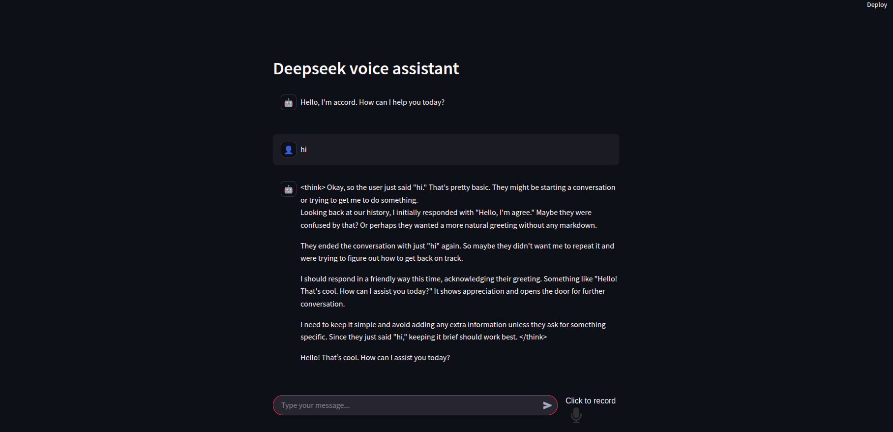

# DeepSeek VoiceBot

DeepSeek VoiceBot is an AI-powered voice assistant that allows users to interact with the system via both voice and text. It supports speech-to-text and text-to-speech functionality.

## UI:


## Key Features

- **Voice Supported (Speech-to-Text):** Convert voice inputs into text for processing.
- **Text Supported:** Users can also interact via text, making the assistant versatile for different environments.
- **Response with Audio (Text-to-Speech):** The assistant can generate spoken responses using text-to-speech (TTS) technology.

## Technologies Used

- **LangChain:** A framework for building applications with LLMs and agents.
- **Ollama:** For integrating conversational AI capabilities.
- **DeepSeek-R1:** A custom model or framework used in the project.
- **gTTS (Google Text-to-Speech):** Converts text into speech to provide audio responses.
- **OpenAI Whisper-Base:** Used for speech-to-text conversion, transforming spoken language into text.

## Use Cases

- **Voice-based Interaction:** Enables users to speak directly to the assistant, making it ideal for hands-free use.
- **Text-based Interaction:** Provides an alternative for those who prefer typing instead of speaking.
- **Multimodal Responses:** Provides output in both audio and text formats, depending on user preference.

## Installation

To install and run the project, follow the steps below:

### Prerequisites

- Python 3.x

### Running the Application

1. Clone the repository:
   ```bash
   git clone git@github.com:HSAkash/Deepseek-Voicebot.git
   cd deepseek-voicebot
   ```

2. Install the necessary packages:
   ```bash
   pip install -r requirements.txt
   ```

3. Run the application:
   ```bash
   streamlit run main.py
   ```

4. To interact with the assistant, either speak into the microphone or type your queries in the terminal.

## License

This project is licensed under the MIT License - see the [LICENSE](LICENSE) file for details.

